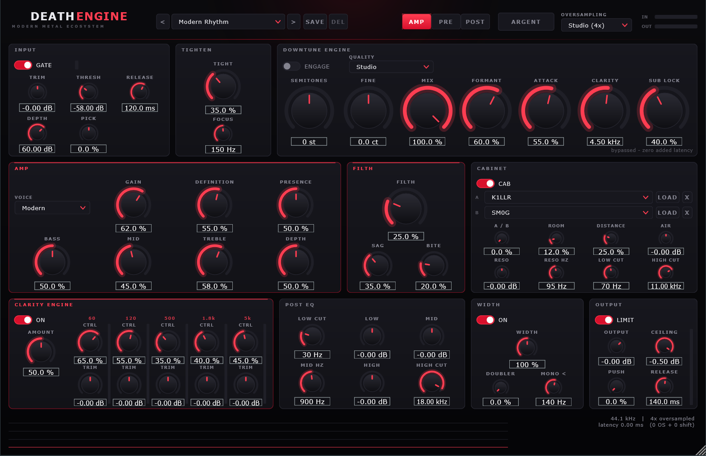
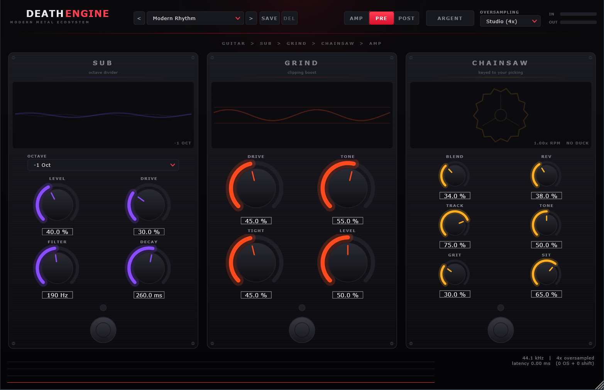
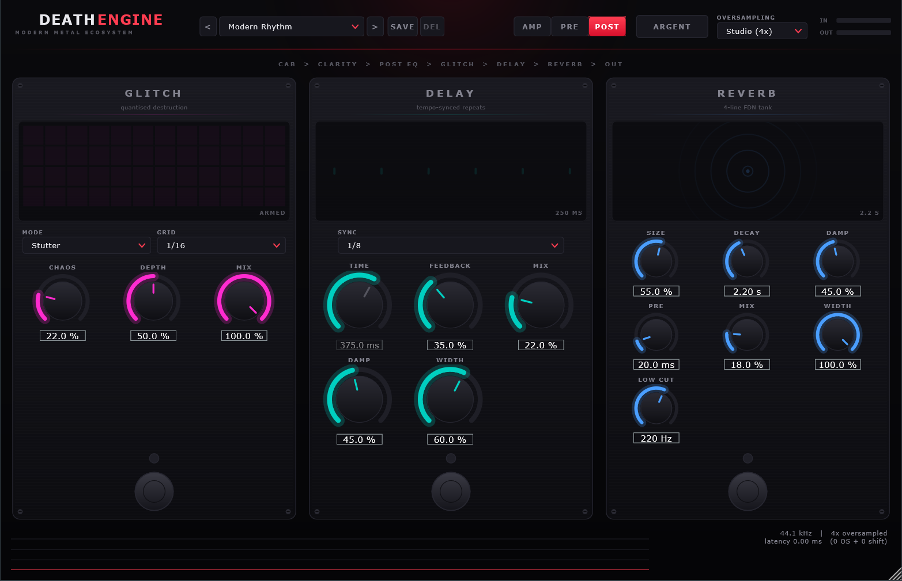
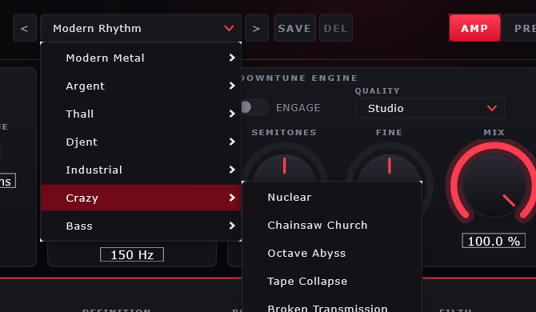

<div align="center">

# DEATH**ENGINE**

### A free, modern metal amp plugin. The whole rig — not just an amp.

*Thall. Djent. Industrial. Argent. One plugin, no ten-pedal chain, no $100+ price tag.*

[](#installation)
[](#installation)
[](#license)

</div>

<p align="center">
  
</p>

---

## What is this

People hear bands doing modern thall, djent and industrial-leaning metal and
think "that's a killer amp." It almost never is — it's a whole chain: gate,
tightening, two amps sometimes, a dynamic EQ working the low end separately from
the highs, saturation, multiband compression, a limiter. Getting that sound
usually means buying several plugins and learning to route them together.

**DeathEngine is that whole chain, built as one plugin**, tuned specifically for
this style rather than modeled after a vintage amp that was never meant to make
this sound in the first place. Guitar in, finished tone out.

- A **purpose-built high-gain amp** — not a 5150 or a Fortin clone, a genre-first
  design with its own gain staging, tone stack and power-amp behaviour
- **Six pedals** built in: an octave sub, a clipping boost, a chainsaw-blend
  effect, a tempo-quantised glitch, a delay and a reverb — all part of the signal
  path, not bolted on
- **A 5-band dynamic EQ** that's most of why modern metal tones stay huge without
  turning to mush
- **±24 semitone pitch shifting** built for guitar, not a generic vocal shifter
- **An "ARGENT" button** for a heavier, more industrial voicing in one click
- **46 presets** across seven categories — rhythm, lead, industrial, bass, and a
  "Crazy" folder that stops pretending to be tasteful
- Runs at **5–30% of one CPU core** depending on how hard you push it

It costs nothing. Take it, use it on your music, give it to your friends.

<p align="center">
  
  
</p>

---

## Installation

### Option A — Download a build (if one is attached to this release)

1. Grab `DeathEngine.vst3` from the [Releases](../../releases) page.
2. Copy it into:
   ```
   C:\Program Files\Common Files\VST3\
   ```
3. Rescan plugins in your DAW.

There's also a **standalone `.exe`** in the release if you just want to plug in
a guitar and play without opening a DAW at all.

### Option B — Build it yourself (always works, takes a few minutes)

You need **Visual Studio 2022** (Community is fine — grab the *Desktop
development with C++* workload) and **CMake 3.22+**. Both are free.

```powershell
git clone --recurse-submodules https://github.com/<your-username>/DeathEngine.git
cd DeathEngine
./build.ps1
```

That fetches JUCE if it isn't already there, builds everything, and runs the
test suite. First build takes a few minutes because it's compiling JUCE from
scratch; every build after that takes seconds.

```
build/DeathEngine_artefacts/Release/VST3/DeathEngine.vst3
build/DeathEngine_artefacts/Release/Standalone/DeathEngine.exe
```

To install the VST3 automatically (needs admin):

```powershell
./build.ps1 -Install
```

Windows only for now — everything is written against JUCE's cross-platform
audio/GUI layer, so a Mac/Linux port is mostly a matter of someone building it
there and testing it. PRs welcome.

---

## Quick start

1. Open DeathEngine on a guitar or bass track (or run the standalone and pick
   your audio interface).
2. Click the **preset dropdown** at the top, pick a category, pick a preset.
3. Play.

That's it. If you want to shape it further: **AMP** is the amp and effects
chain, **PRE** and **POST** are the pedal pages (pedals in front of the amp and
after the cab, respectively), and **ARGENT** pushes the whole thing toward a
heavier, more industrial voicing in one click.

<p align="center">
  
</p>

Presets are grouped so you can find what you want fast:

| Category | What it's for |
|---|---|
| **Modern Metal** | Everyday rhythm and lead tones |
| **Argent** | Sub-driven industrial weight |
| **Thall** | Dark, dissonant, bouncy, low |
| **Djent** | Tight, percussive, articulate |
| **Industrial** | Mechanical, glitched, corroded |
| **Crazy** | Fully experimental — chainsaws, reverse glitches, sub-bass abuse |
| **Bass** | Same engine, voiced for bass DI |

Found a sound you like and tweaked it? Hit **SAVE** to keep it as your own
preset — it's saved as a plain file you can back up or share.

---

## What's actually in it

**The amp** — four cascaded gain stages with a tone stack, a **Filth** knob that
sweeps power-amp sag, crossover distortion, transformer saturation and speaker
breakup together as one macro, and a **Definition** control that's gain along the
axis that actually matters (huge-and-dark to tight-and-modern on one knob).

**The pedals** — in front of the amp: **Sub** (an octave-down synth layer),
**Grind** (a clipping boost), and **Chainsaw** (a real chainsaw sample blended in,
keyed to your picking and ducked under the guitar so you feel it more than you
hear it — yes, that's a nod to a certain DOOM soundtrack). After the cab:
**Glitch** (tempo-quantised stutters, reverses, crushes and tape-stops),
**Delay**, and a 4-line **Reverb**.

**The downtune engine** — polyphonic pitch shifting built specifically for
distorted guitar, accurate to under 2 cents across the full ±24 semitone range,
with formant preservation so a downshifted guitar sounds like a lower-tuned
guitar instead of a slowed-down tape.

**The clarity engine** — five frequency bands, each with its own compressor, so
the low end stays locked in place while the highs stay controlled — which is most
of why this style of tone stays enormous without collapsing into mud.

Full technical breakdown of every control, every DSP decision, and why things
were built the way they were: **[docs/TECHNICAL.md](docs/TECHNICAL.md)**.

---

## System requirements

- Windows 10/11, 64-bit
- A VST3 host (or use the standalone app)
- Any CPU from the last decade or so. AVX2 is on by default for speed — if
  you're on genuinely old hardware, build with `-DDE_ENABLE_AVX2=OFF`

---

## License

This project builds against [JUCE](https://juce.com) under its free tier, which
requires that projects using it without a commercial JUCE license be released
under **GPL-3.0** (or you buy a JUCE commercial license and can then license
your own code however you want). Since this is free and open, it's released
under **GPL-3.0** — see [LICENSE](LICENSE).

Practically, that means: you can use it, modify it, and redistribute it, but any
redistributed version (modified or not) has to stay open source under the same
license. If you just want to play guitar through it, none of this matters —
download it and go.

The four cabinet IRs and the chainsaw sample embedded in the plugin are included
for use within DeathEngine. The `Bogren Digital Rhythm IR Downtuned` folder in
this repo is third-party licensed content used only for local testing — it is
**not** built into the plugin and shouldn't be redistributed separately.

---

## Contributing

Bug reports, preset submissions, and pull requests are all welcome. If you build
a genuinely great preset, open a PR — the goal is for this to become a real
community resource, not just what one person's ears like.

If you're changing DSP code, please run the test suite first
(`./build.ps1` runs it automatically) — there are 250+ automated checks covering
every module, and a change that breaks one is usually a real bug, not a test
that needs updating.

---

<div align="center">

**No subscription. No iLok. No "buy the bundle." Just plug in and go.**

If this saved you some money, consider sharing it with someone else who's been
priced out of a good tone.

</div>
